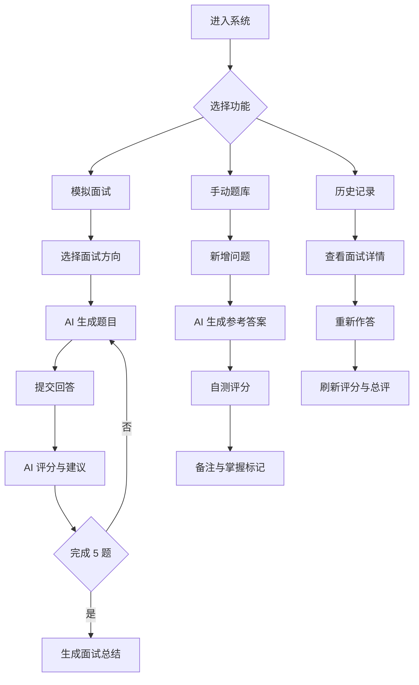
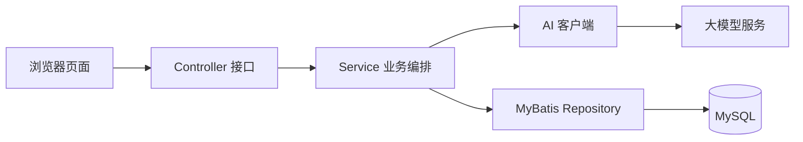

# AI 面试助手

AI 面试助手是一个面向技术面试训练的 Web 系统。系统可以根据面试方向自动生成面试题，接收用户回答，调用大模型完成评分、点评和改进建议，并保存完整的面试历史。同时，系统支持用户维护手动题库，用于日常复习、自测练习和错题沉淀。

## 功能流程图

## 系统结构图

## 主要功能模块

| 模块 | 功能说明 |
| --- | --- |
| 模拟面试 | 按面试方向创建会话，自动生成 5 道题，覆盖基础、并发、中间件、项目、架构等题型。 |
| AI 评分 | 根据题目、参考答案、评分规则和用户回答，输出分数、回答摘要、AI 点评和改进建议。 |
| 面试总结 | 面试结束后汇总总分，生成整体评价，并按低分题给出复盘建议。 |
| 历史记录 | 支持分页查询历史面试、查看详情、删除记录，以及对历史题目重新作答并刷新评分。 |
| 手动题库 | 支持录入自定义问题、AI 生成参考答案、添加备注、按掌握程度标记和筛选。 |
| 自测练习 | 用户可针对手动题目提交自测答案，系统调用 AI 评分并给出针对性建议。 |

## 技术栈

- Java 17
- Spring Boot 3.3.1
- MyBatis
- MySQL
- LangChain4j
- DeepSeek / OpenAI 兼容 Chat Model
- HTML / CSS / JavaScript 静态页面
